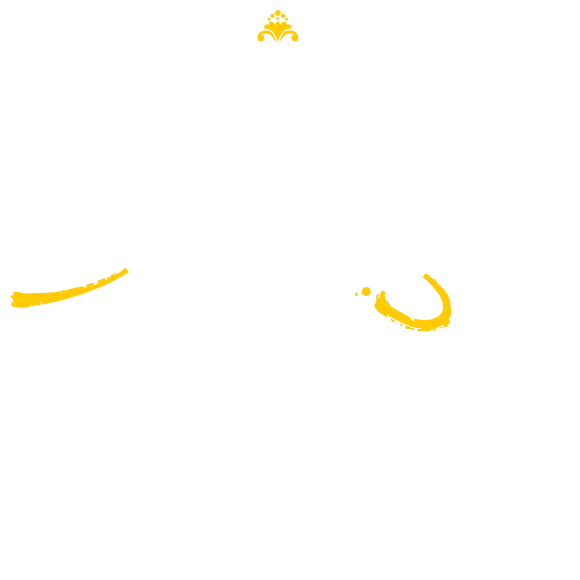
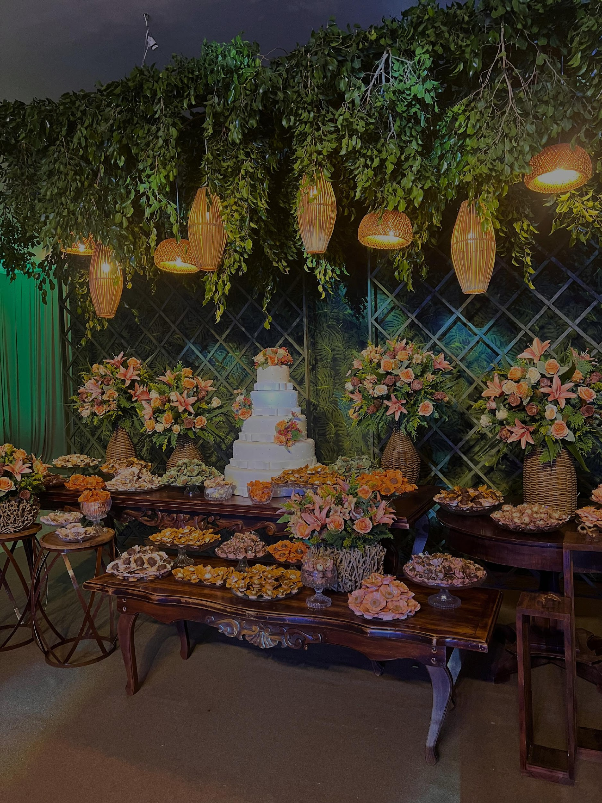
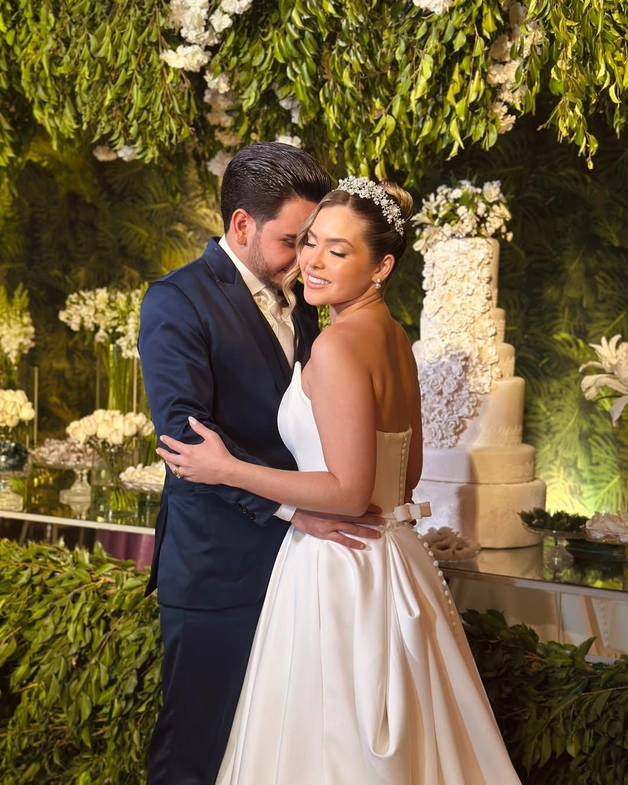

# 🥂 Buffet Sonia Bittencourt — Especialistas em Casamentos de Luxo

<p align="center">
  
</p>

<p align="center">
  <b>O casamento dos seus sonhos merece uma experiência simplesmente perfeita.</b><br>
  Plataforma oficial do Buffet Sonia Bittencourt — Mais de 30 anos de tradição em alta gastronomia, estrutura completa e atendimento consultivo em Cuiabá e região.
</p>

<p align="center">
  <a href="#-sobre-o-projeto">Sobre</a> •
  <a href="#-tecnologias-e-design">Tecnologias</a> •
  <a href="#-funcionalidades-e-experiência">Funcionalidades</a> •
  <a href="#-estrutura-de-arquivos">Arquitetura</a>
</p>

---

## 🌟 Sobre o Projeto

O site oficial do **Buffet Sonia Bittencourt** é uma Landing Page *Cinematic Luxury* desenvolvida para oferecer uma narrativa envolvente e de alta conversão para casais que buscam um evento memorável e sem estresse.

Com design responsivo *mobile-first*, o projeto integra gastronomia de alto padrão, projeto decorativo, sonorização, iluminação e espaço nobre em uma experiência unificada.

---

## 📸 Prévia do Projeto

<p align="center">
  
  
</p>

---

## 🛠️ Tecnologias & Design System

- **Frontend Core:** HTML5 Semântico otimizado para SEO e performance.
- **Styling & Design System (Tailwind CSS):**
  - Paleta de cores *Cinematic Dark* (`#050607`), cartões translúcidos (*glass-editorial*), acentos em Nude (`#E2D3C4`) e Pérola (`#F7F4EF`).
  - Tipografia sofisticada com Google Fonts (*Cormorant Garamond* & *Plus Jakarta Sans*).
- **Recursos Visuais & Interativos:**
  - **Player de Vídeo Cinematográfico:** Vídeo de abertura responsivo com controle flutuante de áudio (`toggleHeroAudio`).
  - **Animações Nativas Fade-Up:** Efeitos de revelação suave em scroll.
  - **Galeria Lightbox Nativa (Vanilla JS):** Visualizador de fotos em tela cheia sem bibliotecas externas.
  - **Carrosséis Horizontais Touch/Scroll:** Navegação por etapas do casamento (*O Começo da História*, *A Celebração*, *A Festa* e *Gastronomia*).
- **Formulário de Qualificação & Conversão:**
  - Formulário com cálculo de orçamento e verificação de data via WhatsApp.
  - Botão flutuante WhatsApp (FAB) presente em toda a navegação.

---

## 📁 Estrutura de Arquivos

```text
├── index.html                  # Aplicação principal (Landing Page Single File)
├── README.md                   # Documentação do repositório
└── assets/                     # Banco de mídias (Vídeos, fotos e logotipos)
    ├── image1.png              # Logo oficial da marca
    ├── vid01.mp4               # Vídeo cinematográfico da Hero
    └── image*.jpg / image*.png # Galeria de fotos de eventos reais
```

---

<p align="center">
  Desenvolvido por <b>Kauã Medeiros</b> | <i>Powered by AntiGravity Methodology</i>.
</p>
